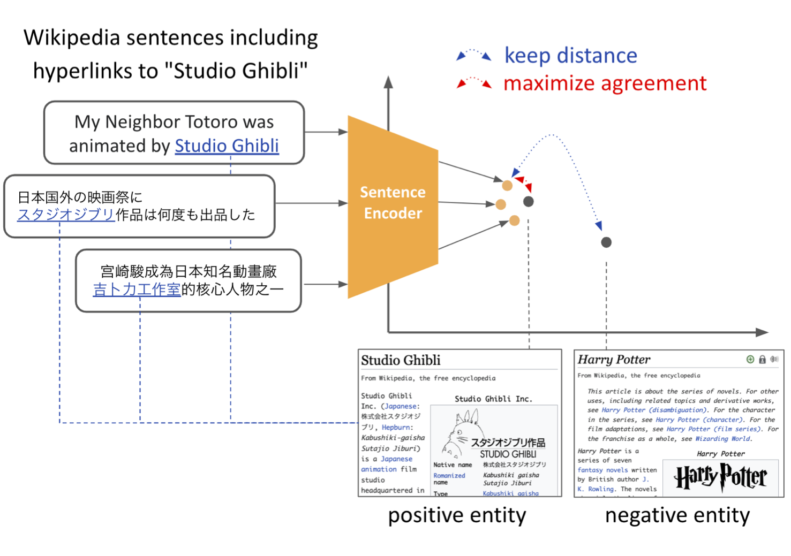

## EASE: Entity-Aware Contrastive Learning of Sentence Embedding

<!-- TODO add license -->
<!-- TODO arxiv link -->
<!-- []() -->
[](https://github.com/huggingface/transformers)
[](https://huggingface.co/sosuke)

EASE is a novel method for learning sentence embeddings via contrastive learning between sentences and their related entities proposed in our paper EASE: Entity-Aware Contrastive Learning of Sentence Embedding.
This repository contains the source code to train the model and evaluate it with downstream tasks.

<!-- TODO NAACL2022の記述 -->
<p align="center">

</p>

## Released Models
[](https://huggingface.co/sosuke)

Our published models are listed as follows.
You can use these models by using [HuggingFace's Transformers](https://github.com/huggingface/transformers).

<!-- huggingface libriryで使えるよ -->


|              **Monolingual Models**             | **Avg. STS** | **Avg. STC** |
|:-------------------------------|:--------:|:--------:|
|  [sosuke/ease-bert-base-uncased](https://huggingface.co/sosuke/ease-bert-base-uncased) |   77.0 |  63.1    |
| [sosuke/ease-roberta-base](https://huggingface.co/sosuke/ease-roberta-base) |  76.8 |  58.6   |
|              **Multilingual Models**              | **Avg. mSTS** | **Avg. mSTC** |
|  [sosuke/ease-bert-base-multilingual-cased](https://huggingface.co/princeton-nlp/sup-simcse-bert-large-uncased)  |   57.2  | 35.5 |
|     [sosuke/ease-xlm-roberta-base](https://huggingface.co/sosuke/ease-xlm-roberta-base)     |   57.1 | 37.1 |


## Use EASE with Huggingface

<!-- TODO add link for pooling methods -->
```python

import torch
from scipy.spatial.distance import cosine
from transformers import AutoModel, AutoTokenizer

# Import our pretrained model. 
tokenizer = AutoTokenizer.from_pretrained("sosuke/ease-bert-base-multilingual-cased")
model = AutoModel.from_pretrained("sosuke/ease-bert-base-multilingual-cased")

# Set pooler (Please see here for other pooling methods).
pooler = lambda last_hidden, att_mask: (last_hidden * att_mask.unsqueeze(-1)).sum(1) / att_mask.sum(-1).unsqueeze(-1)

# Tokenize input texts.
texts = [
    "Ils se préparent pour un spectacle à l'école.",
    "They are preparing for a show at school.",
    "Two medical professionals in green look on at something."
]
inputs = tokenizer(texts, padding=True, truncation=True, return_tensors="pt")

# Calculate cosine similarities
cosine_sim_0_1 = 1 - cosine(embeddings[0], embeddings[1])
cosine_sim_0_2 = 1 - cosine(embeddings[0], embeddings[2])

print(f"Cosine similarity between {texts[0]} and {texts[1]} is {cosine_sim_0_1}")
print(f"Cosine similarity between {texts[0]} and {texts[2]} is {cosine_sim_0_2}")
```

## Setups

[](https://www.python.org/downloads/release/python-376/)
<!-- Python 3.7.6 -->

Run the following script to install the dependent libraries.
```bash
pip install -r requirements.txt
```

Before training, please download the datasets for training and evaluation.
```bash
bash download_all.sh
```
<!-- TODO check download_all.sh -->


## Evaluation

<!-- TODO prepare for colab codes -->

We provide evaluation code for sentence embeddings including Semantic Textual Similarity ([STS 2012-2016](https://aclanthology.org/S16-1081/), [STS Benchmark](https://aclanthology.org/S17-2001/), [SICK-elatedness](http://www.lrec-conf.org/proceedings/lrec2014/pdf/363_Paper.pdf), and [the extended version of STS 2017 dataset](https://aclanthology.org/2020.emnlp-main.365/)), Short Text Clustering ([Eight STC benchmarks](https://aclanthology.org/2021.emnlp-main.467/) and [MewsC-16](#mewsc-16)), Cross-lingual Parallel Matching ([Tatoeba](https://direct.mit.edu/tacl/article/doi/10.1162/tacl_a_00288/43523/Massively-Multilingual-Sentence-Embeddings-for)) and Cross-lingual Text Classification ([MLDoc](https://aclanthology.org/L18-1560/)).

Set your model or path of tranformers-based checkpoint (`--model_name_or_path`),
pooling method type (`--pooler`), and what set of tasks (`--task_set`).
See the example code below.

##### Semantic Textual Similarity
```bash
python evaluation.py \
    --model_name_or_path sosuke/ease-bert-base-multilingual-cased \ 
    --pooler avg \ 
    --task_set cl-sts 
```

##### Short Text Clustering
```bash
python downstreams/text-clustering/evaluation.py \
    --model_name_or_path sosuke/ease-bert-base-multilingual-cased \
    --pooler avg \ 
    --task_set cl
```

##### Cross-lingual Parallel Matching
```bash
python downstreams/parallel-matching/evaluation.py \
    --model_name_or_path sosuke/ease-bert-base-multilingual-cased \ 
    --pooler avg 
```

##### Cross-lingual Text Classification
```bash
python downstreams/cross-lingual-transfer/evaluation.py \
    --model_name_or_path sosuke/ease-bert-base-multilingual-cased \ 
    --pooler avg
```

Please refer to each evaluation code for detailed descriptions of arguments.


## Training


You can train an EASE model in a monolingual setting using English Wikipedia sentences or in a multilingual setting using Wikipedia sentences in 18 languages.

We provide example trainig scripts for both monolingual ([train_monolingual_ease.sh](https://github.com/Sosuke115/EASE/blob/main/train_monolingual_ease.sh)) and multilingual ([train_multilingual_ease.sh](https://github.com/Sosuke115/EASE/blob/main/train_multilingual_ease.sh)) settings.
<!-- TODO link -->


## MewsC-16

We construct [MewsC-16](https://github.com/Sosuke115/EASE/tree/main/text-clustering/data/mewsc16) (**M**ultilingual Short Text **C**lustering Dataset for N**ews** in **16** languages) from Wikinews.
This dataset contains topic sentences from Wikinews articles in 13 categories and 16 languages. More detailed information is available in our paper, Appendix E.

<!-- TODO link -->
<!-- TODO reproduction code -->
##### Statistics and Scores

|              **Language**             | **Sentences** | **Label types** |**XLM-R<sub>base</sub>** |**EASE-XLM-R<sub>base</sub>** |
|:--------:|--------:|--------:|--------:|--------:|
| ar | 2,224 | 11 | 27.9 | 28.1
| ca | 3,310 | 11 | 23.4 | 17.6
| cs | 1,534 | 9 | 23.3 | 41.1
| de | 6,398 | 8 | 31.1 | 39.3
| en | 12,892 | 13 | 27.0 | 41.8
| eo | 227 | 8 | 25.1 | 40.5
| es | 6,415 | 11 | 20.2 | 38.3
| fa | 773 | 9 | 34.1 | 48.1
| fr | 10,697 | 13 | 25.4 | 35.0
| ja | 1,984 | 12 | 44.1 | 45.8
| ko | 344 | 10 | 24.1 | 33.7
| pl | 7,247 | 11 | 24.9 | 41.8
| pt | 8,921 | 11 | 38.4 | 32.4
| ru | 1,406 | 12 | 19.4 | 34.3
| sv | 584 | 7 | 29.8 | 29.8
| tr | 459 | 7 | 29.6 | 45.3
| Avg. |  |  | 28.0 | 37.1


## Citation
[TBA]

<!-- TODO -->